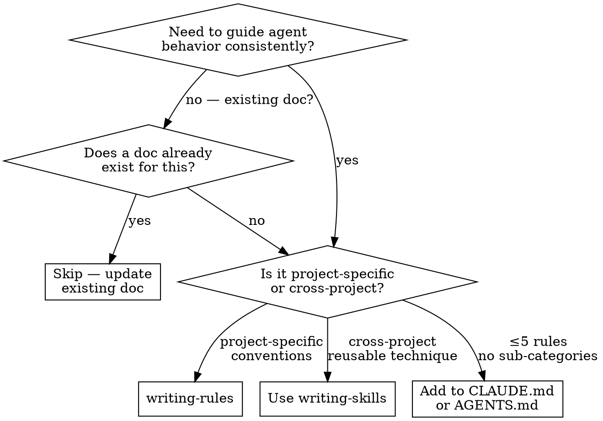

# Writing Rules Documents for Agent Guidance

## Overview

Create strict, unambiguous guideline documents that agents reference during implementation. A rules document codifies decisions about naming, structure, patterns, and conventions so every agent (and human) produces consistent output without rediscovering the rules each time.

**Core principle:** A rules document succeeds when an agent landing on a call site cold, with comments stripped, can still infer and produce correct code. If the rules require shared context or judgment calls, they are unfinished.

**The Iron Law:**

```
NO RULE WITHOUT A GOOD/BAD EXAMPLE PAIR AND A CORRESPONDING ANTI-PATTERN.
```

A rule with no example is ambiguous. A rule with no anti-pattern is unenforceable — you haven't defined what *not* to do. If you can't produce both for a rule, the rule isn't specific enough yet.

**Violating the letter of this process is violating the spirit of creating reliable agent guidance.**

## When to Use



**Use writing-rules for:**
- Naming conventions (functions, predicates, values, modules, files)
- Coding standards and style guides (formatting, idioms, patterns)
- Architectural rules (dependency direction, module boundaries, data flow)
- Commit message conventions and PR templates
- Any document whose audience includes other agents and whose purpose is enforcing consistency

**Do NOT use for:**
- Implementation plans (use `writing-plans`)
- Reusable agent skills (use `writing-skills`)
- One-off instructions (put in a task prompt)
- Agent definitions and system prompts (use `writing-agents`)

**If the rule set is small (≤5 rules, no subcategories):** Put it in `CLAUDE.md`, `AGENTS.md`, or `GEMINI.md` instead of a separate document. Use `writing-rules` only when the document would be too long for those files (the threshold: when the document needs its own table of contents).

## The Process

The process has two paths: **Creation** (Phases 1-5, for new documents) and **Update** (Phase U, for revising existing documents). Choose the path that matches your situation.

### Quick Path (for ≤5 rules, single category)

If the document will govern ≤5 rules within a single category (e.g., just commit message format), use this abbreviated version — it applies the full process's principles without over-engineering:

- **Phase 1:** Do step 3 (principle) and step 4 (categorize). Skip step 1 (decision space — single category is self-evident) and step 5 (scope boundaries — single category doesn't need them). Step 2 (audit) is a 30-second grep or a quick ecosystem check; do NOT skip it entirely.
- **Phase 2:** Draft rules directly.
- **Phase 3:** Write anti-patterns — at least 2-3 covering the category.
- **Phase 4:** Write checklist — 3-5 items.
- **Phase 5:** Do step 1 (ambiguity scan) and step 6 (floor vs ceiling). Skip steps 2-5 — a single-category doc doesn't need cross-category gap checks.

### Phase U: Update Path (for Existing Documents)

When the user invokes `writing-rules` to update an existing rules document, use this path instead of Phases 1-5:

1. **Audit for drift.** Read the existing document. Then audit the codebase against it:
   - Which rules are being followed? Which are routinely violated?
   - Are there new patterns in the codebase that the document doesn't cover?
   - Are any documented patterns obsolete (e.g., legacy API format no longer used)?

2. **Mark obsolete rules.** For each violated or superseded rule:
   - If the rule is wrong: remove it or replace it with the corrected version
   - If the rule is obsolete but referenced elsewhere: mark with `> **DEPRECATED:** [reason]` and keep for one transition cycle
   - If the rule is being followed but a better pattern exists: add the new rule, deprecate the old one, document migration

3. **Add new rules.** Use the per-rule structure from Phase 2 for any new rules needed, matching the format of the existing document (prose-driven or labeled). Maintain internal consistency — do not mix formats within a single document.

4. **Update the Anti-Patterns section.** For each new rule added in step 3, add at least one corresponding anti-pattern entry. If a new rule revises or replaces an existing one, update or remove any anti-patterns that no longer apply.

5. **Update the checklist.** Verify existing checklist items still match. Add items for new rules. Remove items for deleted rules.

6. **Re-verify.** Run the Phase 5 self-review against the updated document.

### Phase 1: Research & Brainstorm (Creation)

**Before writing any rules, understand the domain and existing patterns.**

1. **Identify the decision space.** What kinds of decisions will this document govern?
   - Naming: function names, variable names, file names, class names, test names
   - Structure: module organization, import order, file layout, project tree
   - Process: commit messages, PR format, review criteria, testing expectations
   - Architecture: dependency direction, data flow, module responsibilities

2. **Audit existing patterns.** Branch based on project state:

   *If this is a brownfield project (existing codebase):*
   - Search for patterns already in use — e.g., `grep -r "def " src/ | head -40` to see current naming
   - Look for inconsistencies — e.g., `grep -rP "^(def|class|const)" src/ | sort` to spot naming drift
   - Collect real examples of both good and problematic code
   - **When patterns conflict** (e.g., 60% `create_user` vs 40% `user_create`):
     - (1) Prefer the pattern that matches external language standards (PEP 8, Google Style, idiomatic conventions)
     - (2) If no standard applies, prefer the majority pattern in the codebase
     - (3) If patterns are split evenly, choose the one that better matches the core principle
     - (4) Document the resolution rationale in the rule
     - Do NOT codify both patterns or create a third option — inconsistency is the problem you're solving

   *If this is a greenfield project (no existing code):*
   - Research standards for the language/ecosystem (PEP 8, Google Style, idiomatic patterns)
   - Review conventions from comparable open-source projects
   - Define the principle from first principles (step 3)
   - Anticipate the most common 80% of decisions this document will govern (start with functions and predicates; add retrieval verbs, classes, modules as the project grows)
   - Nominalize that you may need a Phase U update after the first 2-3 weeks of real usage; that's expected, not a failure

3. **Define the principle.** One sentence that captures the philosophy. For naming-conventions: *"name the thing the way the reader would say it."* This becomes the litmus test for every rule below.

4. **Categorize.** What logical groupings emerge? Common categories:
   - By symbol type: functions, predicates, values, classes, modules, files, constants, tests
   - By scope: public API vs internal, library vs application, sync vs async
   - By pattern: retrieval, mutation, creation, validation, configuration

5. **Define scope boundaries.** What is IN and OUT of scope for this document. If you're defining naming conventions, is that only for the public API or does it also apply to internals? Some codebases may need relaxed rules for internals; be explicit.

### Phase 2: Draft the Rules

Each rule must be **unambiguous, testable, and grounded in examples**.

**Per-rule structure (flexible):**

Each rule category should follow a consistent pattern. Choose a structure that suits your topic — the template below shows one valid format, but the `naming-conventions.md` reference example demonstrates a prose-driven alternative. Either is acceptable as long as every rule includes a clear statement, at least one good/bad example, and rationale.

````
## [Category Name]

[Rule statement in natural prose — imperative mood preferred.
If the audience benefits from explicit demarcation, prefix with `**Rule:**`.]

```python
# ✅ Good
specific_example(param)

# ❌ Bad
ambiguous_example(param)
```

[Rationale — inline or labeled as `**Rationale:**`. 1-2 sentences.]

[Edge cases — include only if the rule has known exceptions or
controversial boundaries. Omit for straightforward rules.]
````

**Rationale for flexibility:** The labeled `**Rule:**` / `**Rationale:**` / `**Edge cases:**` format works for rule sets where agents need explicit field-by-field scanning (e.g., generated reference docs). The prose-driven format (as in `naming-conventions.md`) works for documents that read more naturally as a guide. Follow the audience's need: if the document will be referenced as a checklist during coding, structured labels help; if it will be read end-to-end for onboarding, prose reads better.

**Rule quality criteria:**
| Quality | Good | Bad |
|---------|------|-----|
| **Testable** | "Use `verb_noun` for functions" | "Use descriptive names" |
| **Concrete** | "Prefix predicates with `is_`, `has_`, `can_`, `should_`" | "Name predicates clearly" |
| **Exemplified** | Good/bad code pair for every rule | No examples |
| **Bounded** | "Applies to `src/` library code only" | "Always do this" with exceptions |
| **Categorized** | Grouped by symbol type or concern | One flat list of 30 items |

**Write threshold rules at the top.** The most-frequently-needed rules (50%+ of decisions) go first. Group detailed or niche rules lower. An agent should learn the top 3 rules in 10 seconds.

For brownfield projects, base ordering on actual usage frequency from the code audit. For greenfield projects, order by: (1) rules that govern the most common symbol types (functions and predicates first — they appear most often in code), (2) rules with the broadest scope (apply everywhere vs. only in specific modules), (3) rules with the most severe impact when violated (naming patterns affect all new code; module layout affects fewer decisions).

### Phase 3: Add Anti-Patterns

After completing the rules, write a dedicated **Anti-Patterns** section. Each anti-pattern names a specific mistake, shows why it's wrong, and points to the correct rule:

```
- **Domain-first names**: `user_create`, `email_send`, `file_parse` — reverses the imperative
  order. Use `verb_noun` instead (see Functions section).
- **Bare predicates**: `privileged`, `running`, `alive` — ambiguous without `is_` prefix.
  Use an explicit prefix (see Predicates section).
```

This is not optional. Anti-patterns catch agents who read bottom-up, who scan for "what to avoid" first, and who need negative examples to calibrate.

**Every rule must have at least one corresponding anti-pattern**, either as its `# ❌ Bad` inline example (sufficient when the rule's violation is self-evident from the bad example) or as an entry in the dedicated Anti-Patterns section (necessary when the violation needs explanation). If neither exists, the rule is unenforceable — you haven't defined what *not* to do. This follows from the Iron Law.

**When a rule has no plausible anti-pattern** (rare — usually means the rule is too vague), either expand the rule until it does or remove it as unenforceable.

### Phase 4: Write the Decision Checklist

A numbered list of 5-10 questions an agent can run through before every decision governed by the document. This is the enforcement mechanism. Example from naming-conventions:

```
Before adding or renaming a symbol, ask:

1. Does the call site read like the sentence a reader would say?
2. Is this a function? Use `verb_noun`.
3. Is this a predicate? Use `is_`, `has_`, `can_`, or another question prefix.
4. Is this a value or attribute? Use a noun.
5. Is this retrieval? Choose `get_`, `fetch_`, `find_` based on source and trust.
6. ...
```

The checklist must be:
- **Actionable** — each item produces a yes/no answer or directs to a specific rule
- **Ordered** — most common decisions first, quick veto at the top
- **Comprehensive** — covers every rule category (not just the first 3 sections)

### Phase 5: Self-Review

After writing the full document, review with fresh eyes:

1. **Ambiguity scan:** Read each rule as if you were a naive agent with no prior context on this project. Does any phrasing allow two interpretations? If so, sharpen the wording. As a proxy for "two different agents should produce the same code from the same rule," check: would you accept a pull request that implements this rule — confident it matches your intent — without further explanation?
2. **Gap check:** For each category defined in Phase 1, does at least one rule exist? Is every anti-pattern from Phase 3 covered by a positive rule?
3. **Example completeness:** Every rule has at least one good example. Every anti-pattern has at least one bad example. Any rule missing an example needs one.
4. **Verification coverage:** Can an agent verify compliance against the checklist? Run through every checklist item — does each one have a rule it points to?
5. **Consistency check:** Do rules in different sections contradict each other? Do the anti-patterns agree with the positive rules? Is the vocabulary consistent (same terms for same concepts)?
6. **Floor vs. ceiling check:** Does each rule define a minimum bar (floor) or an aspirational ideal (ceiling)? Rules documents work best as floors — minimum acceptable standards that are always enforced. A ceiling rule ("use descriptive names") creates ambiguity because it's never fully satisfied. If a rule reads like a ceiling, rewrite it as a set of floor rules. For example, replace "Choose meaningful names" with "Function names must be `verb_noun`, predicates must use a question prefix, and abbreviations must be expanded outside of tiny scopes."

**Fix any issues inline.** Do not create a second draft — correct the first one. Re-check after each fix.

## Rule Document Template

The template below is one valid starting point. Adapt the format to your topic. The `naming-conventions.md` reference example shows a prose-driven alternative (no `**Rule:**` / `**Rationale:**` labels, rationale embedded in descriptive text) — that is equally valid. The key requirement is **internal consistency**: once you choose a format, apply it across all categories.

````
# [Topic] Conventions / Standards / Rules

A [one-sentence description of what this document governs and who it's for].

The short version: **[core principle — the one-line rule].**

## [Category 1: Most Important / Most Frequent]

[Rule statement. Imperative mood preferred.]

```language
# ✅ Good
correct_example()

# ❌ Bad
incorrect_example()
```

[Rationale — inline prose.]

## [Category 2]

...same pattern...

## [Category N: Least Important / Most Niche]

...same pattern...

## Anti-Patterns

Present as a table (scanable) or bullet list (readable). Either is
fine — stay consistent within the document.

## Decision Checklist

Before [action], ask:

1. [Question] → [Rule reference or yes/no]
2. [Question] → [Rule reference or yes/no]
...
````

**This template is a starting point, not a straitjacket.** Expand sections with more detail where the topic demands it. The naming-conventions document adds a dedicated Retrieval Verbs table and Pluralization section beyond this template — because those topics needed their own treatment.

## Save Location

Save the completed rules document to a deterministic, discoverable path:

```
docs/rules/<topic>.md
```

For a naming conventions document: `docs/rules/naming-conventions.md`.
For commit conventions: `docs/rules/commit-conventions.md`.
For architecture rules: `docs/rules/architecture.md`.
For coding standards: `docs/rules/coding-standards.md`.

If the project has a user preference that overrides this path (e.g., specified in `CLAUDE.md` or `AGENTS.md`), honor it instead.

**Commit the rules document to the repository** so all agents and humans share the same reference. A rules document in version control is discoverable; one left in a conversation history is lost.

### Rules in CLAUDE.md / AGENTS.md / GEMINI.md

If the flowchart routed you here for ≤5 rules (small enough to embed), place them in a dedicated section of your existing agent-instructions file:

```markdown
## Naming Conventions

<!-- inline rules — same quality criteria as standalone docs, just shorter -->

- **Functions:** Use `verb_noun` imperative order. `create_user`, not `user_create`.
- **Predicates:** Use `is_`, `has_`, `can_` prefix. `is_authenticated()`, not `authenticated()`.
- **Values:** Nouns only. `task.status`, not `status_of_task()`.
```

Inline rules must still meet the Iron Law — each needs a clear statement and at least a `# ❌ Bad` example in comments or nearby context. Omit anti-patterns and checklist only if the total rule count is ≤3 and the rules are self-evident; otherwise include them in the same file.

## Common Anti-Patterns

| Anti-pattern | Why it fails | Fix |
|---|---|---|
| **Rules without examples** | Abstract rules are ambiguous; agents produce different interpretations | Every rule gets a good/bad code pair |
| **Ceiling rules** | "Write meaningful names" — never fully satisfiable, creates ambiguity | Rewrite as floor rules: minimum concrete standards |
| **Missing categories** | Flat list of 30 rules is unscanable | Group by symbol type, concern, or frequency |
| **No anti-patterns section** | Agents need negative examples to calibrate | Add dedicated anti-patterns section per category |
| **No decision checklist** | No enforcement mechanism; agents can't self-verify | Add 5-10 actionable checklist items |
| **Assuming shared context** | "Use the usual approach" — what's "usual"? | Make every reference explicit; define the term |
| **Inconsistent example style** | Some rules use Python, some pseudocode, some none | Use one language per example block. For polyglot projects, include examples in each relevant language with clear labels; stay consistent within each language across the document |
| **Burying the most important rule** | Agent reads top 3 rules, misses critical one on line 200 | Order by frequency of use; most-needed first |
| **Vague scope** | "Applies everywhere" — then exceptions pile up | Define exact scope (directories, file types, symbol kinds) |
| **No rationale** | Agents follow the letter without understanding why, leading to creative violations | Each rule gets a 1-2 sentence rationale |

## Verification Checklist

Before claiming a rules document is complete:

- [ ] Does every rule have at least one good example and one bad example?
- [ ] Does every rule have a corresponding anti-pattern entry (either as its `# ❌ Bad` inline example or as a row in the Anti-Patterns section)?
- [ ] Is there a core principle statement (one-line philosophy)?
- [ ] Are rules grouped into logical categories (not a flat list)?
- [ ] Is there a dedicated Anti-Patterns section?
- [ ] Is there a numbered Decision Checklist that an agent can run through?
- [ ] Are all 6 self-review items from Phase 5 checked (ambiguity, gaps, examples, verification, consistency, floor vs. ceiling)?
- [ ] Is the scope explicitly defined (what's in, what's out)?
- [ ] Can the checklist be followed in under 30 seconds for a typical decision?
- [ ] When two different agents read a rule, would they produce the same code?
- [ ] Does a quick grep of the codebase show the document would catch real inconsistencies?

**All must pass. Fix any failures and re-check.**

## Real-World Example

The `naming-conventions.md` document is an example of this skill's output. It demonstrates:

- **Core principle:** "name the thing the way the reader would say it"
- **Categorized rules:** Functions → `verb_noun`, Predicates → question prefixes, Values → nouns, Retrieval → source/trust table
- **Anti-patterns:** 10 named anti-patterns with explanations
- **Decision checklist:** 10 ordered questions
- **Floor rules throughout** — every rule is a concrete minimum, not an aspiration
- **All examples in one language** (Python), consistent formatting

## Common Rationalizations for Skipping the Process

| Excuse | Reality |
|--------|---------|
| "The rules are obvious from the codebase" | If they're obvious, they can be written in 15 minutes. Write them for the next agent. |
| "I already know the conventions, I don't need to write them down" | You're one agent. Others don't share your memory. Write them down. |
| "This is too small to need the full process" | Small rule sets have the most hidden assumptions. The process scales down — the code audit (Phase 1 step 2) can be a 30-second grep in small codebases. Do NOT skip the principle definition (step 3), categorization (step 4), or scope boundaries (step 5). Steps 1 and 2 may be abbreviated but must still be done. If truly ≤5 rules in one category, use the Quick Path below. |
| "I'll document the exceptions as they come up" | Exceptions discovered during implementation become inconsistencies. Define scope up front. |
| "The naming is self-explanatory" | Self-explanatory to you, who wrote it. An agent landing cold sees ambiguity everywhere. |
| "I'll add examples later" | Later never comes. Ship examples with the rule or the rule is unfinished. |
| "I know a bad example when I see one" | Then write it down. Anti-patterns need concrete negative examples to calibrate other agents. |
| "This project is too messy for rules" | Messy projects need rules MOST. Start with one category (e.g., just function naming) and expand. |
| "Rules will slow me down" | Rules prevent rework. One rejected PR due to naming inconsistency costs more than writing the rules. |
| "I'll enforce rules in code review instead" | Code review catches issues per-PR. Rules prevent them per-commit. Both are needed; rules reduce review fatigue. |

## Red Flags — STOP and Revisit

- Writing rules without first auditing existing code patterns → you will write rules that contradict real usage
- A rule that "feels right" but can't be checked mechanically or by inspection → too vague, sharpen or remove
- Rules with no example or no anti-pattern → too vague, sharpen or remove
- A decision checklist that can't be followed in under 30 seconds → too complex, split categories or simplify
- "Agents will just know what I mean" → they won't. Be explicit. Every shared-context assumption is a future inconsistency.
- Assuming one document covers everything → split by topic if a section needs its own table of contents
- "This is too simple to need the full process" → the simplest rules documents have the most hidden assumptions. Even the naming-conventions example started with a single principle.
- Ceiling rules that describe ideals rather than minimums → rewrite as floor rules that define the minimum acceptable standard
- Going back to add examples "later" → stop. Add the example now or the rule is unfinished.
- A rule that applies everywhere with no exceptions → some rules truly are universal, but most need scope boundaries. If you can't find an exception, you haven't thought hard enough about edge cases.
- Citing "common sense" or "industry standard" without defining it → what's standard to you is unknown to another agent. Name the standard, link to it, or collapse its key points into the rule.
